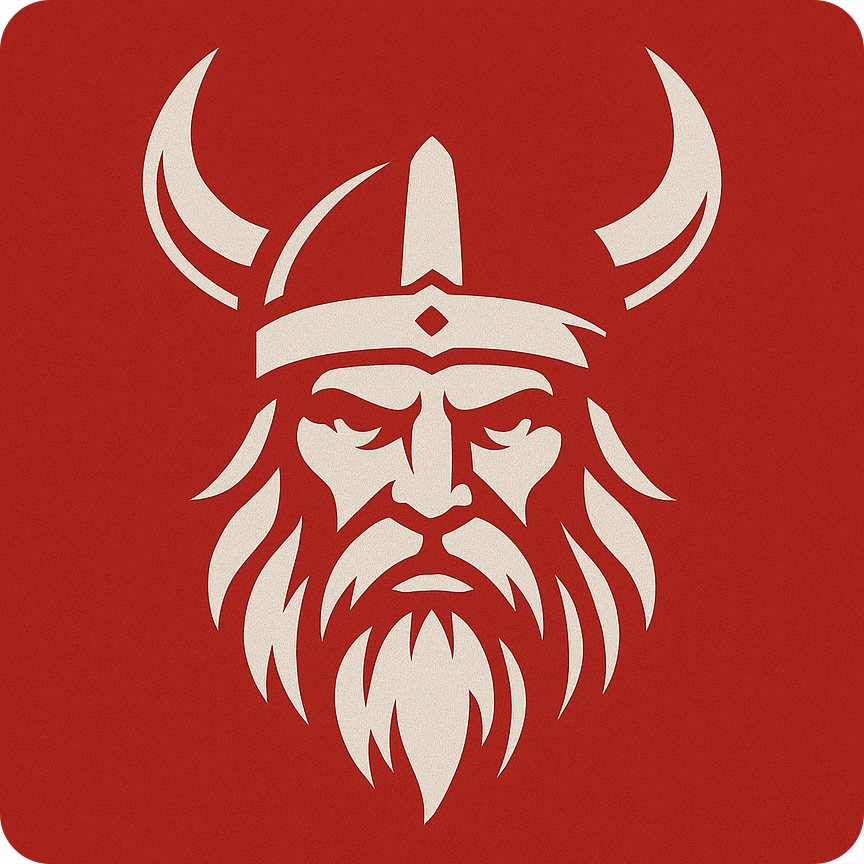
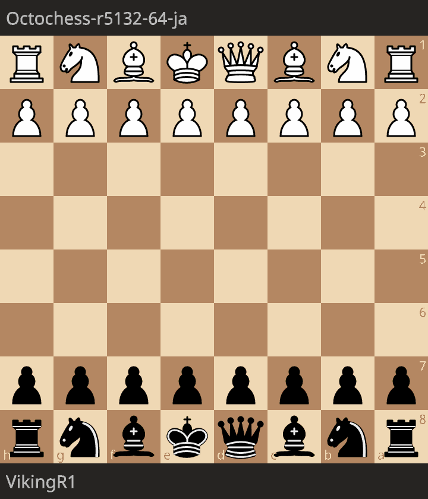

  
  <h1>Viking</h1>
  <h4>Strongest Croatian chess engine.</h4>
  

    
  

## Overview
Viking is a **free and strong UCI chess engine** that can be used to analyze chess positions and come up with the optimal move. Viking does not come with graphical user interface and it is up to the user to choose a GUI of their liking.

  
  

## About the engine
Viking is programmed and fine-tuned in a way to play **aggressive** interesting chess. It will **avoid draws** at all cost, even if that results in a loss. Playing in this fashion makes the games **very entertaining and fun to watch**.

## Playing strength
Viking's **playing strength** is not really known at this point and more robust testing is required to confirm. I suspect it is around **2550 ELO** for the Stockfish **NNUE** version, and around **2100 ELO** for the **hand-crafted** evaluation.
Viking NNUE version easily obliterates [TSCP](https://www.chessprogramming.org/TSCP) by **Tom Kerrigan** and stronger engines like [Thor's Hammer](https://www.chessprogramming.org/Thor%27s_Hammer) by **Toma Roncevic** (another Croatian-made chess engine).

#### Accuracy of the following games was analyzed using Stockfish 17.1 NNUE
### Blitz 3+2

  <table>
    <tr>
      <td align="center">
         
         
         
        Viking outplays TSCP and converts to a winning endgame.
      </td>
      <td align="center">
         
         
         
        A positional masterpiece forcing Thor's Hammer to resign.
      </td>
      <td align="center">
         
         
         
        Viking holds a draw against a ~2600 engine as black.
      </td>
    </tr>
  </table>

### Rapid 30+5

  <table>
    <tr>
      <td align="center">
         
         
         
        Viking shows great positional understanding with this brilliant win.
      </td>
      <td align="center">
         
         
         
        Viking manages to hold a draw with very precise and accurate positional play.
      </td>
      <td align="center">
         
         
         
        Amazing attacking game featuring three sacrifices forcing Beowulf to resign.
      </td>
    </tr>
  </table>

## Board representation
Viking uses the **bitboard approach** for the board representation. Internally it keeps track of **12 bitboards** (one per piece type for each color), as well as **3 bitboards** for occupied squares (white, black and both). The internal board class
also has flags for **side-to-move**, **castling rights**, **en passant**, **fifty move rule** counter etc. Board class also makes it convinient to store past move **history**, as well as heuristics such as **killer** and **history moves**. **Zobrist hashkey** is used 
to differenciate each unique chess position and aids in Viking's **transposition table** implementation. The choice for this board representation approach is clear: ***speed and performance***.

## Move generator
Viking is using **precomputed bitboard attack tables** for generating **pawn**, **knight** and **king** moves. For slider pieces (**bishops**, **rooks** and **queens**), Viking uses **Magic bitboards** by default, but it can also be compiled to use **Hyperbola Quintessence**
move generation. That being said, Viking with Magic bitboards produces **PERFT** speeds of around ***25M nodes/second***, whereas Hyperbola Quintessence does around ***18M nodes/second*** on regular consumer-grade hardware.

## Search
Viking employs traditional **negamax alpha-beta pruning** search algorithm with **many optimizations** added on top. These include **iterative deepening**, **null-move pruning**, **principal variation search**, **transposition table**, **late move reductions** etc.

## Move ordering
**Negamax**: $O(b^d)$ &nbsp;&nbsp;&nbsp; **Alpha-beta (best case)**: $O(b^{d/2})$

In order to make **alpha-beta pruning** as **efficient** as possible, **ordering of moves** is paramount.

- **Transposition table** - If the move is already found in our transposition table, we can just use it.
- **Principal variation** - Best move from the previous search depth is likely to be a good move in the deeper search.
- **MVVLVA** - Most valuable victim, least valuable attacker. Viking orders captures by relative piece value, where bigger score is given to the move where a low value piece (eg. pawn) captures a higher value piece (eg. bishop).
- **Killer moves** - Heuristic used for ordering of quiet moves which caused a beta-cutoff in a sibling node.
- **History moves** - Heuristic used for ordering of quiet moves which caused an increase in alpha in the sibling node.
- **Possible attacks** - Heuristic used for ordering of quiet moves which, if played, would attack an opponents piece. It is similar in nature to MVVLVA, but used for quiet moves instead of capture moves.

Combining all of these **move ordering techniques** causes Viking to pick the **optimal move** within the **first few moves** around **85%** of the time meaning that only about **15%** of the time, it must go through more than a **couple of moves** to obtain a **cuttoff**.

## Evaluation
Viking has two options for position evaluation: **Efficiently Updatable Neural Networks (NNUE)** or **hand-crafted** evaluation. NNUE version is quite a bit stronger and is using this [Stockfish NNUE](https://github.com/official-stockfish/networks/blob/master/nn-eba324f53044.nnue) renamed to **viking.nnue**
for **general aesthetics**. I am planning on introducing a **config** file to hold this, so that the original file names can stay the same.
Below you can see what the hand-crafted evaluation uses.

#### General
- **Material** - Value of each piece on the board weighted by opening/endgame phases.
- **Positional** - Uses piece-square tables to evaluate position of each piece weighted by opening/endgame phases.
- **Space control** - Bonus points for controlling space on the opponent's side of the board.
- **Center control** - Most pieces are strongest in the center, so bonus is given for strong central presence.
- **Tempo** - Bonus for having the right to make a move, it promotes attacking chess.

#### King safety
- **Files** - Penalty for having open or half-open files in front of the castled king.
- **King ring** - Penalty for having too many opponent's pieces near your king.

#### Pawns
- **Doubled pawns** - Penalty is given for doubled or trippled pawns because they can be easily captured.
- **Isolated pawns** - Penalty is give for having pawns without other pawns on either side because they need stronger pieces to defend them.
- **Passed pawns** - Bonus is given for having a passed pawn because it can often promote in the endgame and is difficult to guard.
- **Undefended pawns** - Penalty for having pawns which are not currently defended by other pawns.

#### Knights
- **Mobility** - Bonus for each possible square the knight can jump to.
- **Closed position** - Bonus for having a knight in closed positions because they are more useful than bishops.
- **Undefended knights** - Penalty for having knights which are not currently defended by pawns (outposts).

#### Bishops
- **Mobility** - Bonus for each possible move the bishop can slide to.
- **Bishop pair** - Bonus for having two bishops because they work better in tandem.
- **Blocked bishop** - Penalty for having a bishop blocked by pawns (tall pawn).
- **Color complex** - Bonus for having bishops which can infiltrate gaps in opponent's defenses

#### Rooks
- **Mobility** - Bonus for each possible move the rook can slide to.
- **Files** - Bonus for having rooks on open/half-open files.

#### Queens
- **Mobility** - Bonus for each possible move the queen can slide to.

## UCI Protocol
Viking uses **UCI protocol** which is the most commonly used protocol for **communication** between chess engines and GUIs or other interfaces. This allows Viking to be **connected** to popular software like **Arena Chess GUI** or **Nibbler**.

## Usage
Here is a list of possible commands you can use with Viking **command line interface**.
### uci
*Initializes communication and switches the engine into UCI mode.*
### isready
*Checks whether the engine is fully ready to receive commands.*
### position
*Tells the engine what the current position on the board is and optionally provides a move history.*
- **startpos** → Start from the standard chess initial position.
- **fen** → Start from a custom position defined by a FEN string.
- **moves** → A list of UCI move strings to play from that starting point.
### go
*Tells the engine to start calculating the best move given the current position.*
- **go** → Engine will search infinitelly or until stopped.
- **go depth 10** → Engine will search up to depth 10 and then stop.
- **go movetime 5000** → Engine will search for 5 seconds and then output the best move.
- **go wtime 60000 btime 60000 winc 1000 binc 1000** → Engine will decide it's own search time according to time left.
- **go infinite** → Engine will search indefinitelly or until stopped.
### perft
*Runs engine performance testing from current position to check the overall traversal speed and move generator accuracy.*
- **perft 6** → Engine will perform perft test up to depth of 6.
### displayboard
*Displays the current chess position to the command line interface.*
### displaymoves
*Displays a list of possible moves from the current chess position.*
### displayaftermove
*Causes the engine to display the chess position after making each move.*
### debug
*Tells the engine to display verbose debug logs when analyzing the chess position.*
### testpos
*Engine will check it's optimal move to see if it is among top 3 Stockfish 17.1 NNUE recommendations for accuracy.*
- **testpos 5000** → Engine will search 5 seconds per position inside testpos.csv.

## Acknowledgements
Special thanks to 
- [Bluefeversoft](https://github.com/bluefeversoft) for actually getting me hooked to computer chess, years ago with Vice tutorials.
- [Maksim Korzh](https://github.com/maksimkorzh) for amazing bitboard chess engine tutorial series which inspired me to improve on my earlier efforts.
- [Stockfish](https://github.com/official-stockfish) for some implementation ideas and for borrowing their NNUE files.
- [Chessprogramming Wiki](https://www.chessprogramming.org/Main_Page) for an amazing collection of chess programming knowledge.
